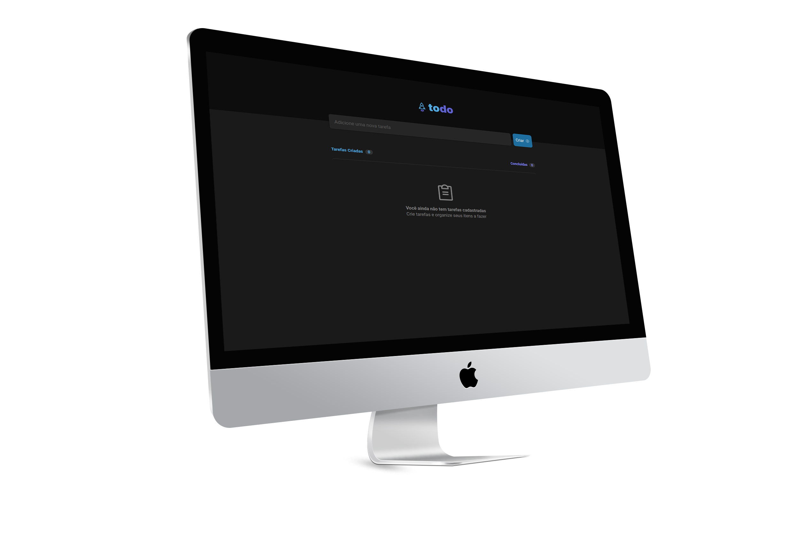

<h4 align="center">
   
</h4>

### ♟ Summary

  <a href="#-preview">Preview</a>&nbsp;&nbsp;|&nbsp;&nbsp;
  <a href="#-live-preview">Live Preview</a>&nbsp;&nbsp;|&nbsp;&nbsp;
  <a href="#-technologies-used">Technologies</a>&nbsp;&nbsp;|&nbsp;&nbsp;
  <a href="#-project">Project</a>&nbsp;&nbsp;|&nbsp;&nbsp;
  <a href="#-layout">Layout</a>&nbsp;&nbsp;|&nbsp;&nbsp;
  <a href="#-license">License</a>&nbsp;&nbsp;|&nbsp;&nbsp;
  <a href="#-development">Development</a>

### 📱 Preview

  

### 💻 Live Preview

- [Vercel](https://to-do-ignite-tau.vercel.app/)

### 📚 Technologies used

- [React](https://reactjs.org/)
- [TypeScript](https://www.typescriptlang.org/)
- [Vite](https://vitejs.dev/)
- [Phosphor Icons](https://phosphoricons.com/)
- [Styled Components](https://styled-components.com/)

### 🚀 Project

**To do Ignite** is an application made to organize your tasks.

### 🎨 Layout

You can view the project layout in [Figma](<https://www.figma.com/file/rzNabK6SRKOL6RfE3V2Jkf/ToDo-List-(Copy)>).

### 📝 License

**To do Ignite** is released under the [MIT License](./LICENSE).

---

### 👨‍💻 Development

Developed with 💜 by **Tiago Martins Vargas**.
